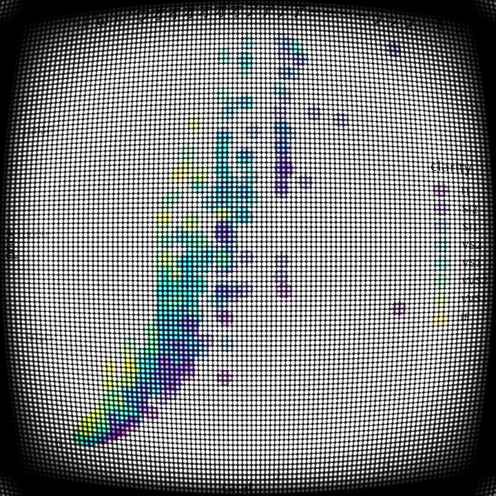

<!-- README.md is generated from README.Rmd. Please edit that file -->

# wgpugd: A WebGPU Graphics Device for R

<!-- badges: start -->
<!-- badges: end -->

## Overview

### What is WebGPU?

[WebGPU](https://www.w3.org/TR/webgpu/) is an API that exposes the
capabilities of GPU hardware. As the name indicates, it’s primarily
designed for the Web. However, it’s not only for the Web[^1].

### What is wgpu?

As the name indicates, the wgpugd package uses [wgpu](https://wgpu.rs/),
a pure-Rust implementation of the WebGPU standard. wgpu is what’s behind
the WebGPU support of Firefox and Deno, and is widely used over the
Rust’s graphics ecosystem.

### Wait, Rust…? Can we use Rust in R??

Yes! [extendr](https://extendr.github.io/) is the Rust framework for
interacting with R.

### Why WebGPU for R?

The main motivation is to add post-effect to graphics with [WebGPU
Shader Language (WGSL)](https://www.w3.org/TR/WGSL/%3E). But, of course,
the power of GPU should simply contribute to high performance!

## Installation

You can install the development version of wgpugd like so:

``` r
devtools::install_github("yutannihilation/wgpugd")
```

## Usages

:warning: wgpugd is currently at its verrry early stage of the
development! :warning:

``` r
library(wgpugd)
library(ggplot2)

file <- knitr::fig_path('.png')
wgpugd(file, 10, 10)

set.seed(10)
dsamp <- diamonds[sample(nrow(diamonds), 1000), ]

ggplot(dsamp, aes(carat, price)) +
  geom_point(aes(colour = clarity)) +
  labs(title = "Now I can", y = "render", x ="texts!!!") +
  theme(text = element_text(size = 20), legend.position = "none")

dev.off()
#> png 
#>   2

knitr::include_graphics(file)
```



## References

-   wgpugd uses [extendr](https://extendr.github.io/), a Rust extension
    mechanism for R, both to communicate with the actual graphics device
    implementation in Rust from R, and to access R’s graphics API from
    Rust.
-   If you are curious about developing a Rust program with wgpu, I’d
    recommend [Learn Wgpu](https://sotrh.github.io/learn-wgpu/) to get
    started.
-   [lyon](https://github.com/nical/lyon) is a library for “path
    tessellation,” which is necessary to draw lines on GPU.

[^1]: <https://kvark.github.io/web/gpu/native/2020/05/03/point-of-webgpu-native.html>
